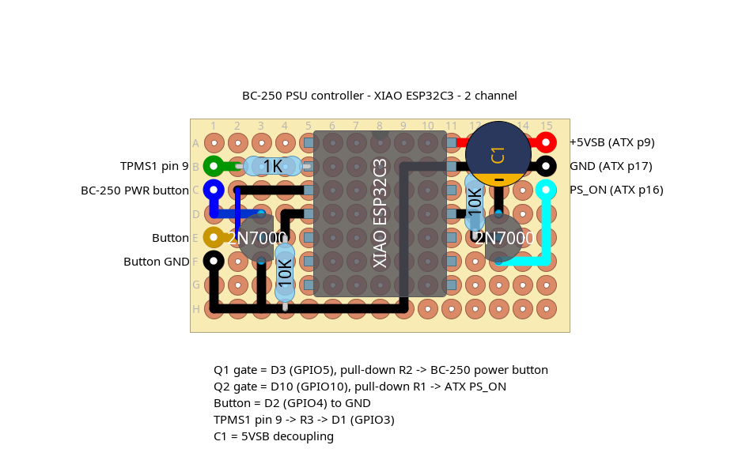

# BC250 ESP32 Power Switch

A XIAO ESP32-C3 power controller for an AMD **BC250** board running as a desktop. The
BC250 is fed from a PCI-E connector and has no ATX power button, so this firmware
drives the SFX PSU's `PS_ON#` line, taps the board's own power-button input for
graceful ACPI shutdowns, and senses board power — giving you a real power button, plus
optional "turn on when I pick up my controller" via Bluetooth.

## Features

- **Push-button power**: tap to turn on; hold 5 s while running for a graceful ACPI
  shutdown (the OS shuts down, then the PSU is cut); keep holding to 10 s to force off.
- **Follows the board**: if the OS shuts the board down, the PSU is cut automatically.
- **Power-button kick**: if the board is still in standby 2 s after the PSU comes on
  (BIOS not set to boot on AC), the controller taps `PWRBTN#` to start it.
- **Boot watchdog**: if the board doesn't come up within 15 s, the PSU is released.
- **BLE controller wake** (optional): when a bound controller (e.g. an 8BitDo) powers
  on, the machine powers on with it.
- **WiFi setup portal**: configure the bound controller from a phone — no reflashing.

## Wiring

The XIAO ESP32-C3 is permanently powered from the ATX connector's **5 V standby**, so
it runs whether the machine is on or off. It shares ground with the PSU and the board
through the ATX connector.

Both switched lines go through a **2N7000 low-side MOSFET** with a gate pull-down, so
the ESP only ever drives a gate and never touches the 5 V `PS_ON#` rail or the board's
`PWRBTN#` pull-up directly. The pull-downs also keep both FETs off while the ESP is
booting and its GPIOs are still high-impedance. See [Board layout](#board-layout) for
the perfboard build.

| XIAO | GPIO | Connects to | Notes |
|------|------|-------------|-------|
| D1 | GPIO3 | BC250 `TPMS1` pin 9 (via series R3) | ~3.3 V when the board is up, 0 when off; read as ADC |
| D2 | GPIO4 | Momentary switch | Internal pull-up; other side of the switch to GND |
| D3 | GPIO5 | Q1 gate (R2 pull-down) → drain to BC250 `PWRBTN#` | HIGH = FET on = button pressed; pulsed 500 ms for a tap |
| D10 | GPIO10 | Q2 gate (R1 pull-down) → drain to ATX `PS_ON#` (green) | HIGH = FET on = `PS_ON#` LOW = PSU on |
| 5V / GND | — | ATX +5VSB (pin 9) / GND (pin 17) | Permanent power for the ESP |

`PWRBTN#` is the board's own power-button line (the one a front-panel switch would
short to ground). Q1 shorts it for a brief tap, which the OS treats as an ACPI power
event and shuts down cleanly. The pulse is kept well under the ~4 s at which the board's
hardware "hold to hard-off" override would kick in.

`TPMS1` is a higher-impedance signal that hovers near the logic threshold, so it's read
as an analog voltage with hysteresis rather than a digital pin.

### Board layout



The build is a small perfboard with the XIAO ESP32-C3 in the middle and one 2N7000
channel on each side. The DIYLC source is
[`hardware/bc250-xiao-2channel.diy`](hardware/bc250-xiao-2channel.diy).

| Ref | Part | Role |
|-----|------|------|
| M1 | XIAO ESP32-C3 | Controller; powered from +5VSB |
| Q1 | 2N7000 | Shorts BC250 `PWRBTN#` to GND. Gate = D3 (GPIO5) |
| Q2 | 2N7000 | Shorts ATX `PS_ON#` to GND. Gate = D10 (GPIO10) |
| R1 | 10 kΩ | Q2 gate pull-down |
| R2 | 10 kΩ | Q1 gate pull-down |
| R3 | 1 kΩ | Series resistor between `TPMS1` pin 9 and D1 (GPIO3) |
| C1 | Electrolytic | +5VSB decoupling at the XIAO's 5V/GND pins |
| J1 | Wire jumper | Routes the button pad to D2 (GPIO4) |

Off-board connections, left edge top to bottom: `TPMS1` pin 9, BC-250 power button
pad, momentary button, button GND. Right edge: +5VSB (ATX pin 9), GND (ATX pin 17),
`PS_ON#` (ATX pin 16). The XIAO's USB port stays accessible for flashing and serial
debug.

Both FETs are wired source→GND, drain→line, gate→GPIO (2N7000 with the flat face
towards you is S-G-D left to right). The 2N7000 is not a true logic-level part
(`Vgs(th)` up to 3 V), so if a channel doesn't pull its line below ~0.5 V with 3.3 V on
the gate, substitute a logic-level FET (e.g. AO3400) or an NPN with a 1 kΩ base
resistor.

### Connector pinouts

**ATX 24-pin main connector** — tap three pins:

```
               +3.3V ─┤  1 │ 13 ├─ +3.3V
               +3.3V ─┤  2 │ 14 ├─ −12V
                 GND ─┤  3 │ 15 ├─ GND
                 +5V ─┤  4 │ 16 ├─ PS_ON#   ◄── Q2 drain (gate = D10/GPIO10)
                 GND ─┤  5 │ 17 ├─ GND      ◄── ESP GND (any GND pin works)
                 +5V ─┤  6 │ 18 ├─ GND
                 GND ─┤  7 │ 19 ├─ GND
              PWR_OK ─┤  8 │ 20 ├─ (RSVD)
ESP 5V/VIN ◄── +5VSB ─┤  9 │ 21 ├─ +5V
                +12V ─┤ 10 │ 22 ├─ +5V
                +12V ─┤ 11 │ 23 ├─ +5V
               +3.3V ─┤ 12 │ 24 ├─ GND
```

**TPMS1 header** — single pin for board-power sense:

```
   PCICLK ─┤  1   2 ├─ GND
    FRAME ─┤  3   4 ├─ SMB_CLK_MAIN
  PCIRST# ─┤  5   6 ├─ SMB_DATA_MAIN
     LAD3 ─┤  7   8 ├─ LAD2
       3V ─┤  9  10 ├─ LAD1      ◄── pin 9 (3V) = board-on sense ──► D1/GPIO3
     LAD0 ─┤ 11  12 ├─ GND
          ─┤     14 ├─ S_PWRDWN#
     3VSB ─┤ 15  16 ├─ SERIRQ#
      GND ─┤ 17  18 ├─ GND
```

Pin 9 is the only TPMS1 pin used: it reads ~3.3 V when the board is powered and 0 V when
off. No ground wire is needed from this header — the ESP already shares ground with the
board through the ATX connector.

## Button controls

| Action | Result |
|--------|--------|
| Tap while **off** | Power on |
| Hold ≥ 5 s while **on** | Graceful shutdown: taps `PWRBTN#`, OS shuts down, PSU cut once the board is down |
| Hold ≥ 10 s while **not off** | Force power off (cuts the PSU immediately) |
| Hold ≥ 8 s while **off** | Enter WiFi setup portal |

If the board is still up 90 s after the ACPI tap (the OS ignored or cancelled it), the
controller logs a warning and returns to normal ON so you can try again.

The button is the primary control and always works, even with no controller configured.

## Bluetooth controller wake

When a controller is bound (via the portal), the machine **follows the controller**:
turn the controller on and the machine powers up. After a power-off there's a short
guard window so the controller's reconnect burst can't immediately switch it back on —
turn the controller off within that window to keep the machine down.

## Setup portal

Hold the button ≥ 8 s while off (or on first use) to start the portal:

1. Connect to the open WiFi network **`BC250 Switch Setup`** and open `http://192.168.4.1`.
2. Create a password.
3. Pick your controller from the live BLE scan (or enter its MAC).
4. Finish — the device reboots into normal operation.

## Build & flash

PlatformIO (pioarduino). Two steps — firmware and the portal's web UI (a single
`app/index.html` packed into SPIFFS):

```bash
pio run -t upload     # firmware
pio run -t uploadfs   # web UI filesystem
```

## Notes

- **WiFi TX power**: these ESP32-C3 *mini* boards have an RF/power quirk
  ([arduino-esp32 #6551](https://github.com/espressif/arduino-esp32/issues/6551)) where
  the SoftAP is invisible at full power. The portal sets `WIFI_POWER_8_5dBm`
  (`AP_TX_POWER` in [include/board.h](include/board.h)) to work around it.
- Serial debug runs over USB-CDC at **115200** baud.
- Pin assignments and all timing constants live in [include/board.h](include/board.h).
